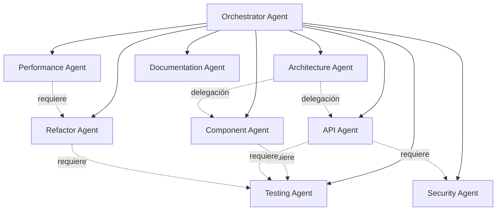

# Sistema de Agentes - Digital Revolution

Sistema de orquestación de agentes especializados para prevenir "AI slop" y asegurar calidad de código.

## 🎯 Filosofía

**Especialización > Generalización**: Cada agente tiene un rol específico con expertise profundo, anti-patterns documentados y protocolos de coordinación claros.

## 📊 Arquitectura de Agentes



## 🤖 Catálogo de Agentes

### Orchestrator Agent

**Rol**: Coordinador maestro
**Responsabilidad**: Descomponer tareas complejas y delegar a especialistas
**Delega a**: Todos los demás agentes
**Archivo**: [`orchestrator.agent.md`](./orchestrator.agent.md)

### Architecture Agent

**Rol**: Diseñador de sistemas
**Responsabilidad**: Diseñar arquitectura feature-first, definir estructura de carpetas
**Delega a**: component-agent, api-agent, refactor-agent
**Archivo**: [`architecture.agent.md`](./architecture.agent.md)

### Component Agent

**Rol**: Creador de componentes UI
**Responsabilidad**: Crear componentes React/Astro siguiendo design system
**Requiere**: testing-agent para validación
**Archivo**: [`component.agent.md`](./component.agent.md)

### API Agent

**Rol**: Desarrollador backend
**Responsabilidad**: Diseñar e implementar endpoints RESTful con seguridad
**Requiere**: security-agent (validación), testing-agent
**Archivo**: [`api.agent.md`](./api.agent.md)

### Refactor Agent

**Rol**: Especialista en calidad de código
**Responsabilidad**: Mejorar código existente sin cambiar funcionalidad
**Requiere**: testing-agent (antes y después de refactor)
**Archivo**: [`refactor.agent.md`](./refactor.agent.md)

### Testing Agent

**Rol**: QA y testing
**Responsabilidad**: Crear tests (unit, integration, e2e) siguiendo pirámide de testing
**Trabaja con**: Todos los agentes
**Archivo**: [`testing.agent.md`](./testing.agent.md)

### Performance Agent

**Rol**: Optimización de performance
**Responsabilidad**: Optimizar bundle size, LCP, FID, CLS
**Requiere**: refactor-agent para implementar optimizaciones
**Archivo**: [`performance.agent.md`](./performance.agent.md)

### Security Agent

**Rol**: Auditor de seguridad
**Responsabilidad**: Detectar vulnerabilidades, implementar mejores prácticas OWASP
**Trabaja con**: api-agent principalmente
**Archivo**: [`security.agent.md`](./security.agent.md)

### Documentation Agent

**Rol**: Documentador técnico
**Responsabilidad**: Crear JSDoc, OpenAPI specs, READMEs, ADRs
**Trabaja con**: Todos los agentes después de completar features
**Archivo**: [`documentation.agent.md`](./documentation.agent.md)

## 🎭 Workflows Comunes

### 1. Crear Nueva Feature

```markdown
User: "Crear sistema de votación para concursos"

Orchestrator Agent:
└─> Architecture Agent: Diseñar arquitectura
Output: Estructura de carpetas, interfaces TypeScript

└─> API Agent: Implementar endpoints
└─> Security Agent: Revisar seguridad
Output: Endpoints con auth, rate limiting, validación

└─> Component Agent: Crear componentes UI
Output: VotingButton, VoteCounter, VotingProgress

└─> Testing Agent: Crear suite de tests
Output: Unit + Integration + E2E tests

└─> Performance Agent: Optimizar
Output: Lazy loading, code splitting

└─> Documentation Agent: Documentar
Output: README, OpenAPI spec, JSDoc
```

### 2. Refactorizar Módulo

```markdown
User: "Refactorizar módulo de concursos"

Orchestrator Agent:
└─> Architecture Agent: Analizar estructura actual
Output: Reporte de problemas, propuesta de mejora

└─> Testing Agent: Verificar coverage existente
Output: Tests suficientes? Si no, crear más

└─> Refactor Agent: Implementar mejoras
Output: Código mejorado (sin cambiar funcionalidad)

└─> Testing Agent: Validar que tests siguen pasando
Output: ✅ Todos los tests pasan

└─> Performance Agent: Verificar no hay regresión
Output: Bundle size OK, performance OK
```

### 3. Hotfix de Bug Crítico

```markdown
User: "API retorna 500 en producción"

Orchestrator Agent: [Fast track, minimal delegation]
└─> Diagnóstico directo
Output: Identificar causa raíz

└─> API Agent o Refactor Agent: Fix mínimo
Output: Bug corregido

└─> Testing Agent: Test que reproduce bug
Output: Test falla antes, pasa después

└─> Deploy inmediato
```

## 📋 Matriz de Decisión

### ¿Qué agente usar?

| Tarea                           | Agente Principal    |
| ------------------------------- | ------------------- |
| Diseñar arquitectura de feature | Architecture Agent  |
| Crear componente React/Astro    | Component Agent     |
| Crear endpoint API              | API Agent           |
| Mejorar código existente        | Refactor Agent      |
| Crear tests                     | Testing Agent       |
| Optimizar performance           | Performance Agent   |
| Revisar seguridad               | Security Agent      |
| Documentar código               | Documentation Agent |
| Coordinar tarea compleja        | Orchestrator Agent  |

### ¿Cuándo delegar vs ejecutar?

**Delegar cuando**:

- Requiere expertise específico
- Trabajo puede paralelizarse
- Es parte de workflow estándar

**Ejecutar directamente cuando**:

- Tarea trivial (< 5 min)
- Urgencia crítica
- Exploración/investigación

## 🚫 Anti-Patterns del Sistema

### ❌ NO saltarse agentes requeridos

```markdown
❌ MAL:
User: "Crear endpoint de votación"
→ Component Agent implementa directamente
(Falta: Security Agent, Testing Agent)

✅ BIEN:
User: "Crear endpoint de votación"
→ Orchestrator Agent delega:

1. API Agent: implementa endpoint
2. Security Agent: revisa seguridad
3. Testing Agent: crea tests
```

### ❌ NO duplicar responsabilidades

```markdown
❌ MAL:
Architecture Agent diseña UI detallada
(Eso es responsabilidad de Component Agent)

✅ BIEN:
Architecture Agent diseña estructura general
Component Agent diseña UI detallada
```

### ❌ NO ignorar anti-patterns de agentes

```markdown
❌ MAL:
Performance Agent optimiza sin medir primero
(Viola su propio anti-pattern)

✅ BIEN:
Performance Agent:

1. Medir performance actual
2. Identificar bottlenecks
3. Optimizar targets específicos
4. Validar mejora
```

## 🎓 Mejora Continua

### Retrospectivas

Después de cada feature compleja, hacer retrospectiva:

```markdown
## Retrospectiva: Feature X

### ¿Qué funcionó bien?

- Delegación clara de tareas
- Comunicación efectiva entre agentes

### ¿Qué mejorar?

- Estimaciones fueron optimistas
- Security Agent debió involucrarse antes

### Ajustes

- Security Agent en Fase 1, no Fase 4
- Buffer de 20% en estimaciones
```

### Métricas de Calidad

```markdown
## Métricas del Sistema

### Code Quality

- Coverage: > 80% ✅
- Duplicación: < 5% ✅
- Complejidad: < 10 ✅

### Performance

- LCP: < 2.5s ✅
- FID: < 100ms ✅
- Bundle: < 500KB ✅

### Security

- Vulnerabilidades críticas: 0 ✅
- OWASP Top 10: Covered ✅
- Rate limiting: Implementado ✅

### Documentation

- JSDoc coverage: > 90% ✅
- README actualizado: ✅
- OpenAPI spec: ✅
```

## 🛠️ Herramientas

### Validación de Agentes

```bash
# Verificar que todos los agentes están presentes
ls .github/agents/*.md

# Contar agentes
ls .github/agents/*.md | wc -l

# Buscar anti-patterns no documentados
grep -r "❌ NO" .github/agents/
```

### Testing del Sistema

```typescript
// scripts/validateAgentSystem.ts
import { readdir, readFile } from 'fs/promises';
import { join } from 'path';

async function validateAgents() {
  const agentsDir = '.github/agents';
  const files = await readdir(agentsDir);

  const agents = files.filter((f) => f.endsWith('.agent.md'));

  console.log(`📊 Agentes encontrados: ${agents.length}`);

  for (const agent of agents) {
    const content = await readFile(join(agentsDir, agent), 'utf-8');

    // Validar estructura
    const hasAntiPatterns = content.includes('## 🚫 Anti-Patterns');
    const hasWorkflow =
      content.includes('## Workflow') || content.includes('## 🔄');
    const hasCoordination = content.includes('## 🤝 Coordinación');

    console.log(`\n${agent}:`);
    console.log(`  Anti-patterns: ${hasAntiPatterns ? '✅' : '❌'}`);
    console.log(`  Workflow: ${hasWorkflow ? '✅' : '❌'}`);
    console.log(`  Coordination: ${hasCoordination ? '✅' : '❌'}`);
  }
}

validateAgents();
```

## 📚 Recursos

- [Multi-Agent Systems](https://en.wikipedia.org/wiki/Multi-agent_system)
- [Context7 Documentation](https://context7.mintlify.dev)
- [Orchestration Patterns](https://microservices.io/patterns/orchestration.html)
- [Agent Coordination Theory](https://www.cs.cmu.edu/~softagents/multi.html)

## 🤝 Contribuir

Para añadir un nuevo agente:

1. Crear archivo `.github/agents/[nombre].agent.md`
2. Seguir template:

   ```markdown
   ---
   name: 'agent-name'
   description: 'brief description'
   version: '1.0.0'
   role: 'orchestrator' | 'specialist'
   expertise: [list]
   tools: [list]
   ---

   # Agent Name

   ## 🎯 Objetivos

   ## 🚫 Anti-Patterns

   ## Workflow

   ## 🤝 Coordinación

   ## 📚 Recursos
   ```

3. Actualizar este README con el nuevo agente
4. Actualizar diagrama de arquitectura
5. Crear PR con justificación

---

**Versión**: 1.0.0
**Última actualización**: 2025-01-20
**Mantenedores**: @digital-revolution-team
